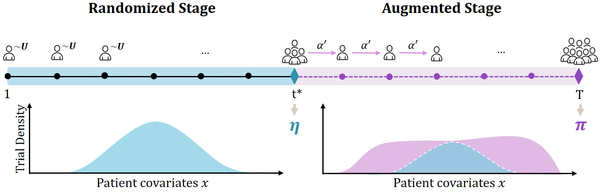

# Towards Regulatory-Confirmed Adaptive Clinical Trials: Machine Learning Opportunities and Solutions </br><sub><sub>Omer Noy Klein, Alihan Hüyük, Ron Shamir, Uri Shalit, Mihaela van der Schaar [AISTATS 2025]</sub></sub>

An implementation of **Randomize First Augment Next (RFAN)** -- a two-stage clinical trial framework designed to both comply with regulatory standards and arrive at effective and fair treatment policies, based on causal deep Bayesian active learning.



## Paper Abstract
Randomized Controlled Trials (RCTs) are the gold standard for evaluating the effect of new medical treatments. Treatments must pass stringent regulatory conditions in order to be approved for widespread use, yet even after the regulatory barriers are crossed, real-world challenges might arise: Who should get the treatment? What is its true clinical utility? Are there discrepancies in the treatment effectiveness across diverse and under-served populations? We introduce two new objectives for future clinical trials that integrate regulatory constraints and treatment policy value for both the entire population and under-served populations, thus answering some of the questions above in advance. Designed to meet these objectives, we formulate Randomize First Augment Next (RFAN), a new framework for designing Phase III clinical trials. Our framework consists of a standard randomized component followed by an adaptive one, jointly meant to efficiently and safely acquire and assign patients into treatment arms during the trial. Then, we propose strategies for implementing RFAN based on causal, deep Bayesian active learning. Finally, we empirically evaluate the performance of our framework using synthetic and real-world semi-synthetic datasets.

## Installation
```.sh
$ conda env create -f environment.yml
$ conda activate ada-trial
$ pip install .
```

## Run
```.sh
$  python -m src.main 
$  python -m src.main --dataset synthetic --max_acquisitions 30 --switching_step 14
```

## Repository structure
This repository is organised as follows:
```bash
rfan-trial/
    |- src/                          # RFAN's source code
        |- active_learning/          # Modules for active learning for the augmented trial stage
           |- early_stopping/           # Active stage with ES
           |- acquisitions.py           # Acquisition functions for patient selection
           |- assignments.py            # Treatment assignments rules
           |- active_learning.py        # Core logic for executing active learning steps

        |- datasets/                 # synthetic and semi-synthetic data preprocessing
           |-  active_learning_data.py  # Handles data pools
           |-  covid.py                 # COVID-19 data preprocessing
           |-  iwpc.py                  # IWPC warfarin dataset preprocessing
           |-  synthetic.py             # Synthetic dataset generation
           |-  data_utils.py            # Data processing utilities

        |- models/                   # Model training
           |- modules/               # Submodules for model components
           |- core.py                # Core training and inference logic
           |- deep_kernel.py         # Deep Kernel Gaussian Process (DKGP) model
           |- models_utils.py        

        |- evaluation/               # Evaluation and plotting modules        
        |- main.py                   # Main script to run experiments
        |- benchmark.py              # Experimental benchmark setup and running
        |- config.py                 # Configuration settings
        |- tuning.py                 # Model tuning utilities
        |- policy.py                 # Treatment policy construction
        |- utils.py                  # Other utilities
      
    |- reports/                      # Stores experiment results and model checkpoints
    |- environment.yml               # Conda environment setup
    |- setup.py                      # Package setup file
```

## Further info
- You can modify **`config.py`** and **`benchmark.py`**  to adjust experimental setups
- After downloading the corresponding datasets, you can find our data parsers in the **`datasets/`** directory. 

## Contact
For any questions, feel free to reach out to: <br>
📧 Omer Noy Klein (omernoy4@gmail.com)

